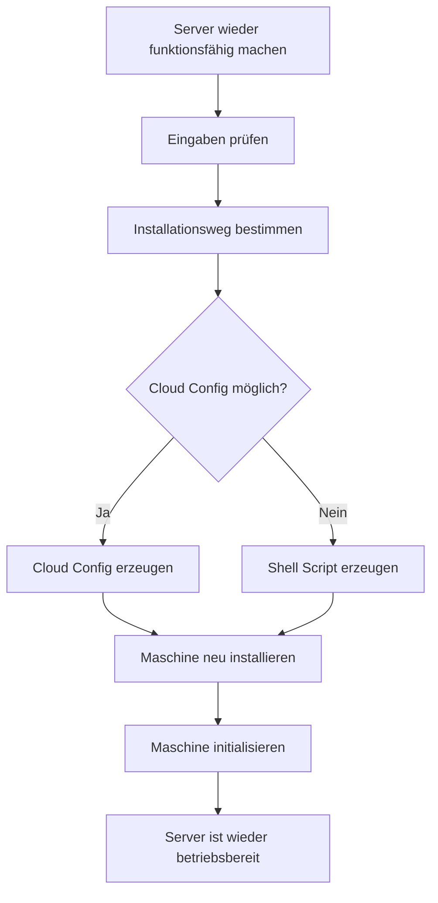

# UI Clarity Loop

Use this skill as a workflow, not as a bag of design tips.

The goal is to move from:

- noisy screen
- unclear hierarchy
- duplicated navigation
- card-heavy layout

to:

- one clear UI type
- one clear layout
- one clear active view
- one clean rendered result

## The loop

For every meaningful UI change, write these checkpoints out before moving on:

1. `UI type`
2. `Current hierarchy`
3. `Affected views`
4. `Main problems`
5. `Change plan`
6. implement
7. render or inspect
8. `Result after render`
9. `What still feels wrong`

Important:

- do not keep the review implicit
- write the review briefly but visibly
- make the next change respond to the written review

If the UI changed but no visible self-review was produced, the loop is incomplete.

If one view was fixed but sibling views sharing the same pattern were not checked, the loop is incomplete.

## Step 1: Identify the UI type

Before touching layout or styling, decide what kind of interface this is.

Common types:

- landing page
- document or tutorial
- dashboard
- tool or workspace
- wizard or setup flow
- editor
- inspector

Do not let a landing-page structure leak into a tool UI.

### ASCII examples

Landing page:

```text
+--------------------------------------------------+
| top nav                                          |
+--------------------------------------------------+
| hero                                             |
| message                                          |
| cta                                              |
+--------------------------------------------------+
| section                                          |
+--------------------------------------------------+
| section                                          |
+--------------------------------------------------+
```

Tool or workspace:

```text
+----------------------+---------------------------+
| side nav             | active work area          |
| nav item             |                           |
| nav item             | current task              |
| nav item             | current task              |
| nav item             | current task              |
+----------------------+---------------------------+
```

Wizard:

```text
+--------------------------------------------------+
| progress / steps                                 |
+--------------------------------------------------+
| current step                                     |
| current step                                     |
| current step                                     |
+--------------------------------------------------+
| back                              next           |
+--------------------------------------------------+
```

Editor:

```text
+----------------------+---------------------------+
| side nav / explorer  | editor                    |
| file                 | code                      |
| file                 | code                      |
| file                 | code                      |
+----------------------+---------------------------+
```

## Step 2: Map the user journey

Before choosing the layout, write the user journey from the user's goal, not from UI events.

Bad journey:

- page opens
- tab opens
- button is clicked

Good journey:

- user wants an outcome
- user checks or decides something
- user takes an action
- user reaches a result

Keep it short and goal-based.

Use Mermaid when helpful.

Example:



Purpose:

- define the real path the UI must support
- separate the main path from exception paths
- avoid designing screens before understanding the flow

## Step 3: Choose the layout family

Once the UI type is clear, choose the layout family.

Good default for tools:

- persistent navigation
- one active main view
- optional progress above the work area
- supporting details only where needed

### Good and bad layout patterns

Bad: landing-page composition for a tool

```text
+--------------------------------------------------+
| hero                                             |
| big message                                      |
+--------------------------------------------------+
| grid of cards                                    |
| grid of cards                                    |
+--------------------------------------------------+
```

Bad: second sidebar inside the main view

```text
+----------------------+----------------+----------+
| side nav             | steps          | content  |
| nav                  | step 1         | content  |
| nav                  | step 2         | content  |
| nav                  | step 3         | content  |
+----------------------+----------------+----------+
```

Good: one navigation system, one progress system

```text
+----------------------+---------------------------+
| side nav             | step indicator            |
| nav                  +---------------------------+
| nav                  | active step content       |
| nav                  |                           |
| nav                  | primary action            |
+----------------------+---------------------------+
```

Rules:

- one primary navigation system
- one primary progress system
- main area is for work, not for a second navigation tree

## Step 4: Define area roles before styling

Before you style a region, decide its role.

Common roles:

- navigation
- progress
- work
- context
- action
- diagnostics

Ask for each region:

1. what role is this?
2. what content belongs here?
3. how loud should it be?
4. is it repeating something already shown elsewhere?

### Area scaffolds

Navigation area:

```text
+----------------------+
| scope                |
| project / machine    |
|                      |
| nav item             |
| nav item             |
| nav item             |
|                      |
| global action        |
+----------------------+
```

Work area:

```text
+--------------------------------------+
| title                         status |
| short instruction                    |
|--------------------------------------|
| main content                         |
| main content                         |
|                                      |
| primary action                       |
+--------------------------------------+
```

Context area:

```text
+--------------------------------------+
| Machine      primary-vps             |
| IP           82.165.198.246          |
| Address      admin.aryazos.ch        |
+--------------------------------------+
```

Diagnostics area:

```text
+--------------------------------------+
| activity                             |
|--------------------------------------|
| run 1                                |
| run 2                                |
| run 3                                |
+--------------------------------------+
```

## Step 5: Keep the surfaces honest

Do not let the interface turn into panels and cards everywhere.

Prefer:

- one emphasized work surface
- one quieter support region
- flat lists
- spacing and hierarchy over stacked boxes

Avoid:

- card in card
- every section as a card
- active list items that become floating mini panels
- two neighboring regions both styled like equally heavy panels

### ASCII examples

Bad: card in card

```text
+--------------------------------------+
| big panel                            |
|  +--------------------------------+  |
|  | smaller panel                  |  |
|  | actual content                 |  |
|  +--------------------------------+  |
+--------------------------------------+
```

Good: quiet support region plus one workspace

```text
+----------------------+---------------------------+
| support area         | work surface              |
| plain list           | title                     |
| plain list           | content                   |
| plain list           | action                    |
+----------------------+---------------------------+
```

### Container hierarchy check

Ask:

1. is the gap created by layout?
2. or is the gap really parent padding around a fake panel?

Prefer:

- parent provides structure and gap
- child owns its own inner padding

Avoid:

- parent adds outer padding and child also has a background block
- that makes the child read like a floating card

## Lists must still look like lists

Whenever the UI contains steps, files, jobs, or nav rows, review the list as its own artifact.

Ask:

1. does it still read like a list?
2. did the active row become a mini card?
3. are badges competing with the row title?
4. is the order clearer than the decoration?

Bad:

```text
Steps
|
+-- [card row]
+-- [card row]
+-- [card row]
```

Good:

```text
Steps
|
+-- row
+-- row  <-- active
+-- row
```

Use:

- one accent line, marker, or text emphasis
- not a full floating card for the active row

## Labels must earn their place

Do not spray labels across the interface.

Use labels when:

- a raw value would be unclear without one
- the content is an IP, hostname, number, amount, count, or other compact datum

Do not use labels when:

- the sentence already explains itself
- a heading already provides the meaning
- the label just repeats what the user can already read

Prefer:

- normal case
- readable weight
- compact spacing

Avoid:

- thin all-caps meta text
- decorative labels above already clear sentences

## Tool UI defaults

For dashboards, tools, recovery flows, and setup apps:

- keep the outer shell locked to the viewport
- let inner lists or content areas scroll
- do not make the whole page scroll like a document

For clickable controls, especially with shadcn/ui:

- buttons should feel clickable immediately
- use a pointer cursor for button-like controls
- use a disabled cursor for disabled controls

## Done means proven

Do not report the UI as done until you have evidence.

Minimum proof:

1. build or run the UI
2. render the affected result
3. compare the result against the written problem list
4. write a short proof note

Bad proof:

- "I changed the CSS, so it should be fixed"

Good proof:

- "The duplicated progress was removed, the step list is now flat, and the sibling views using the same shell were checked again"
