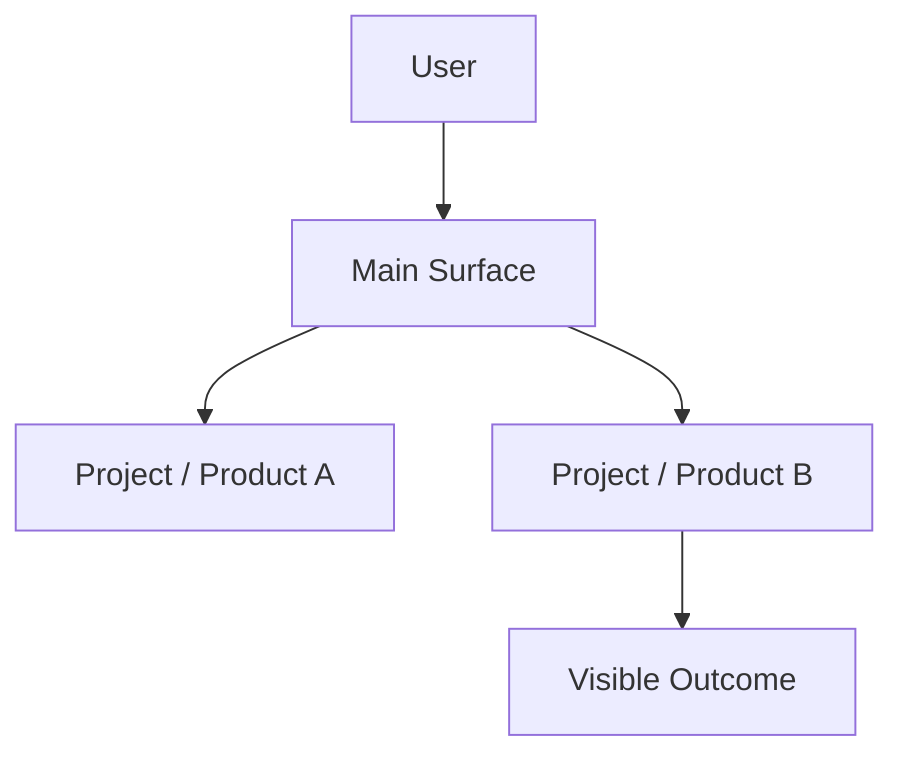
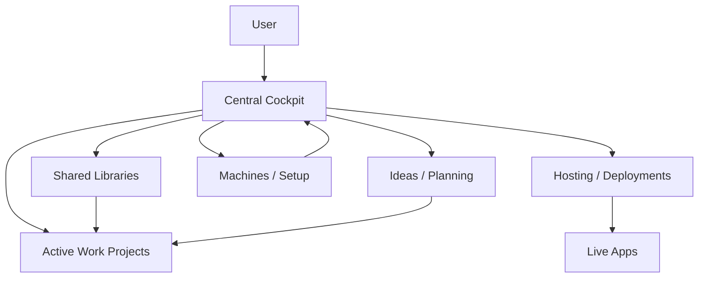

# User View Architecture

Use this skill to explain architecture as the user experiences it, not as code is implemented.

## Core rule

Always include a diagram.

Default to Mermaid because it is fast, editable, and easy to paste into docs. Use Figma, FigJam, ASCII, or another format only when the user asks for that output or the context clearly needs a visual artifact outside chat.

## Perspective

Draw from the user's point of view:

- start with the user or their main cockpit surface
- show projects, products, tools, machines, and services as components
- hide implementation details unless they change the user's mental model
- show what each component is responsible for in plain labels
- prefer relationships like "uses", "deploys", "backs up", "organizes", "hosts", or "feeds"

Avoid low-level details by default:

- files
- classes
- internal APIs
- database tables
- package names
- protocol details
- deployment internals

Only add those when the user explicitly asks for a technical follow-up.

## Diagram selection

Choose the simplest shape that matches the question:

- **Project landscape**: hub-and-spoke with the central user surface in the middle.
- **User workflow**: left-to-right flow from intent to outcome.
- **System layers**: top-down layers from user surface to projects to runtime/hosting.
- **Ownership map**: grouped boxes by responsibility, with arrows only for important dependencies.

Do not overfit the diagram. The goal is a useful overview, not a complete inventory.

## Default workflow

1. Identify the user's main surface or starting point.
2. Group components into 3-7 meaningful buckets.
3. Name components using product/project names where possible.
4. Add only the relationships that matter to the user.
5. Produce a Mermaid diagram.
6. Add a short explanation and a compact bottom-line summary.

If local project knowledge is incomplete, still provide a useful first diagram and label uncertain parts as assumptions.

## Mermaid style

Use readable labels and keep nodes short.

Prefer:

For project landscapes, this pattern is usually best:

## Response shape

Keep the response short:

1. one sentence explaining the view
2. the diagram
3. two or three bullets explaining the important relationships
4. a compact bottom-line summary

The bottom-line summary should include the key interpretation, caveats, and any obvious next action.
